# React ePortfolio Documentation

## Intro
This documentation provides the same information as the React App shown in the ePortfolio presentation:
1. **About React**: general information about React and its key features
2. **Development**: insights into React development particularities
3. **Component Examples**: showroom of some components
For further information, you can check the [GitHub Repository](https://github.com/EhrlerL/se-testapp). In addition to the source code, you will also find the [sources](https://github.com/EhrlerL/se-testapp/blob/master/sources/sources.md) which provide useful stuff about React, Bootstrap and JSX.

## What is React?
### JavaScript Library created by Meta

- build user interfaces
- component-based
- build web or native apps
- use JSX

### Component-Based Development

- create your own components
- use frameworks like Bootstrap
- combine component into screens/pages/apps
- resuse components multiple times

### JSX Syntax
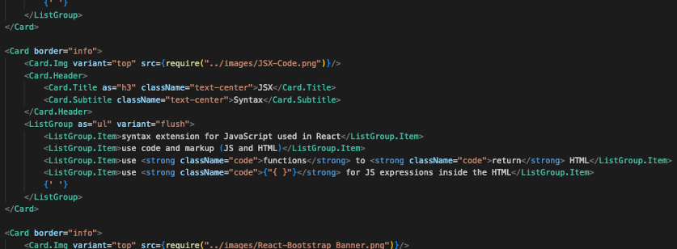
- syntax extension for JavaScript used in React
- use code and markup (JS and HTML)
- use 'functions' to 'return' HTML
- use '{ }' for JS expressions inside the HTML

### React-Bootstrap Frontend Framework

- replaces Bootstrap JavaScript
- no dependencies needed (e.g. jQuery)
- many components like buttons, cards or navs
- easy to install and use

## Developing a React Frontend
### Getting started - create-react-app
- create the app by typing 'npm install create-react-app my-app' in the terminal
- navigate to the app directory by typing 'cd my-app' in the terminal
- start the app by typing 'npm run start' in the terminal
- by default, the app opens on 'http://localhost:3000/'
- **optional**: install React-Bootstrap via 'npm install react-bootstrap bootstrap'

#### Requirements:
- IDE (e.g. **VSCode**)
- **npm** or **yarn** has to be installed

### Project Structure Basics
- the main page is 'App.js'
- all components must directly or indirectly be referenced in 'App.js'
- in 'App.js', you can import 'bootstrap/dist/css/bootstrap.min.css'
- alternatively you can edit your own CSS or Sass stylesheets

#### Folder Structure
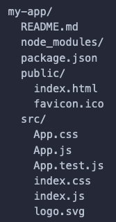

## Creating and Importing Components
### Creating Components
1. Create a new JSX file, e.g. Test.js in the src folder or a sub folder.

   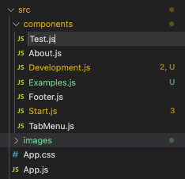
2. Add the basic JSX structure. This structure is required for every JSX file. 

   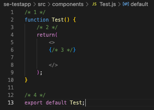
   1. Add your JavaScript code inside the function that is named after your component. Make shure that any variables and functions are declared before the 'return' function.
   2. The return function contains the JSX code. It is slightly adapted HTML combined with JavaScript. JavaScript code has to be nested using curly brackets.
   3. In JSX, multiple elements on the same level must be wrapped in a single element, like a 'div'. A short form of this is just using '<> ... </>'.
   4. Finally, your component has to end by 'export default Test;'.
> Note that you cannot use HTML comments. You need to use the JavaScript comment syntax and therefore wrap a comment into curly brackets.
3. Start adding the actual component code. 

   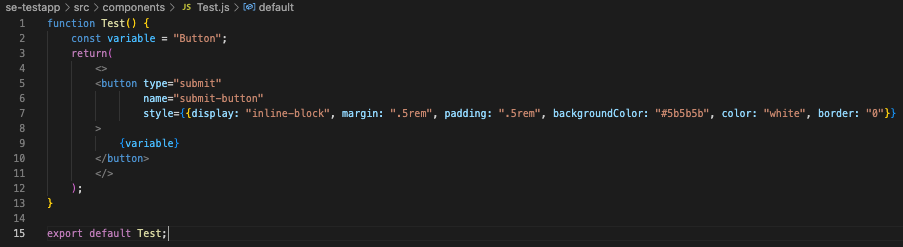
   - In this component, a HTML button is configured as a submit button with some CSS.
   - The button has the text "Button". This is because the 'const variable' has been declared before the return function.
   - In JSX, HTML Tags must always be closed. Otherwise, this will cause an error.
> Using the style attribute requires two curly brackets since the CSS is formatted as JSON. Note that instead of using dashes ('background-color'), you need to use lowerCamelCase ('backgroundColor').

### Importing Components
1. You can import components at the top of another component or the "top component" App.js. In the path, you do not need to add the file type '.js'

   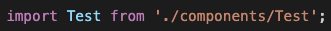
2. To display the component, you need to add it as a HTML element.

   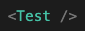

   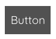
> Remember that in JSX, HTML tags must always be closed.

## Importing Bootstrap Components
1. Just like with your own components, you need to import Bootstrap components at the top of another component.

   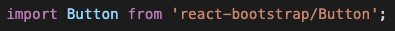
2. To display the component, you need to add it as a HTML element.

   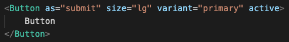
   
   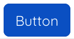
> Bootstrap components are highly customisable. For further information, it is useful to check the official [React-Bootstrap Documentation](https://react-bootstrap.netlify.app/).